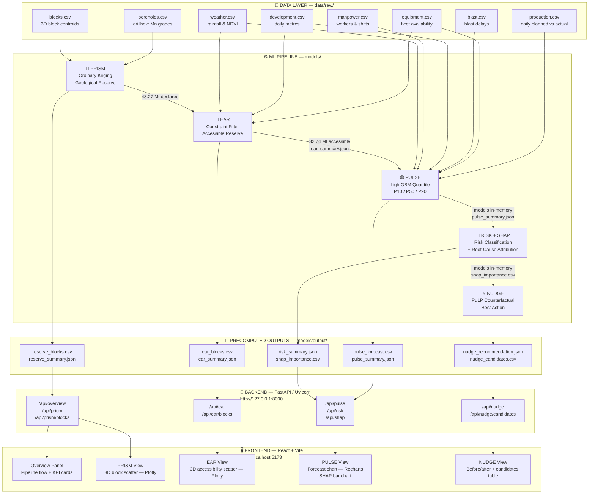
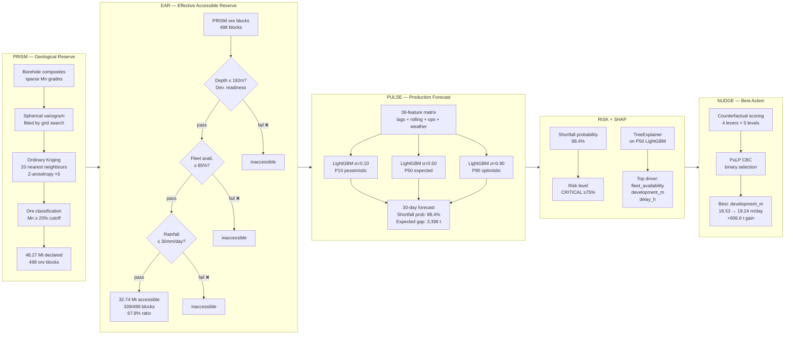
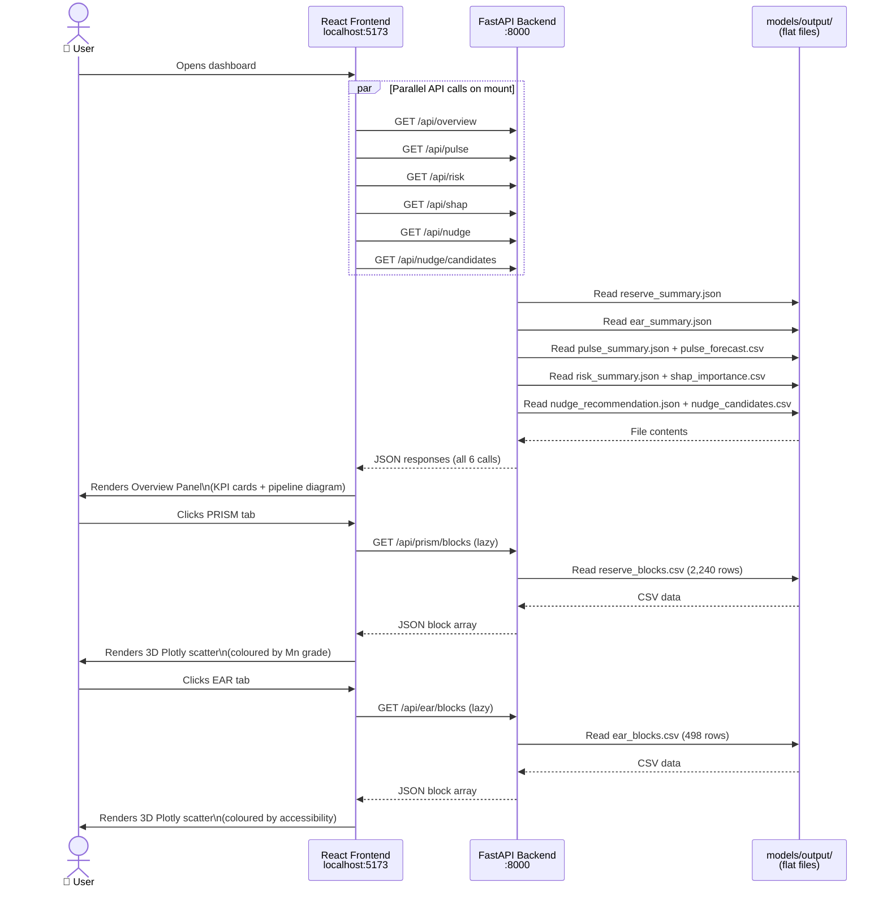
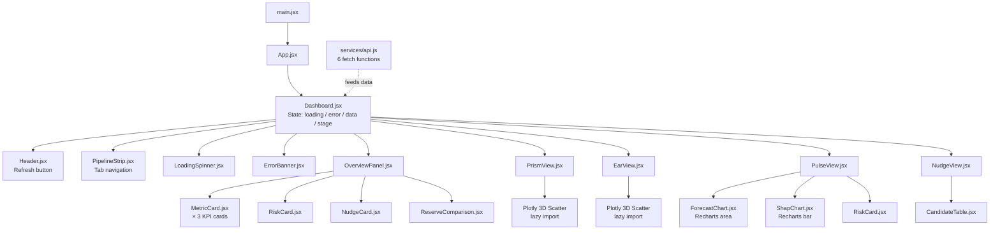
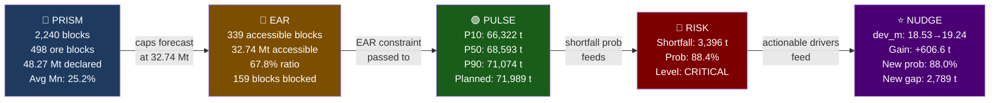

# OreSight — Architecture Diagrams

> These diagrams render in VS Code (with Mermaid Preview), GitHub, and Notion.
> In VS Code: install **"Markdown Preview Mermaid Support"** extension, then open preview with `Ctrl+Shift+V`.

---

## 1. Full System Architecture

---

## 2. ML Pipeline — Stage by Stage

---

## 3. Data Flow Through the API

---

## 4. Frontend Component Tree

---

## 5. Key Numbers Flow

---

## How to View These Diagrams

| Tool | How |
|---|---|
| **VS Code / Kiro** | Install [Markdown Preview Mermaid Support](https://marketplace.visualstudio.com/items?itemName=bierner.markdown-mermaid), open this file, press `Ctrl+Shift+V` |
| **GitHub** | Push to any repo — GitHub renders Mermaid in `.md` files natively |
| **Mermaid Live Editor** | Paste any diagram block at [mermaid.live](https://mermaid.live) to edit and export as PNG/SVG |
| **Notion** | Paste the code block inside a `/code` block and set language to `mermaid` |
| **draw.io / Lucidchart** | Use [mermaid.live](https://mermaid.live) → export as SVG → import into draw.io |
